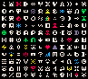

# tomo monsuta

A Rogue-like game for the PICO-8 fantasy console written in Toki Pona, made following the [Lazy Devs Roguelike tutorial](https://www.youtube.com/playlist?list=PLea8cjCua_P3LL7J1Q9b6PJua0A-96uUS) series plus some extra ideas.

## sitelen pona font

## ideas

-   player name
-   choose different player characters
-   "save progress" using a hash-like password
